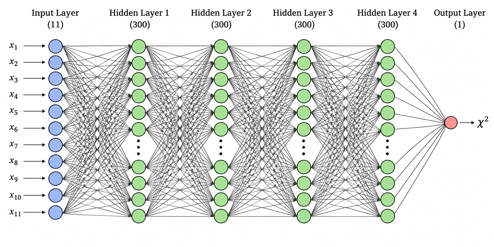
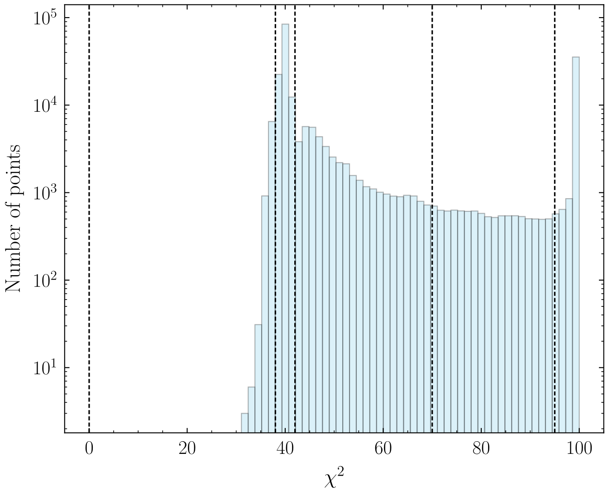
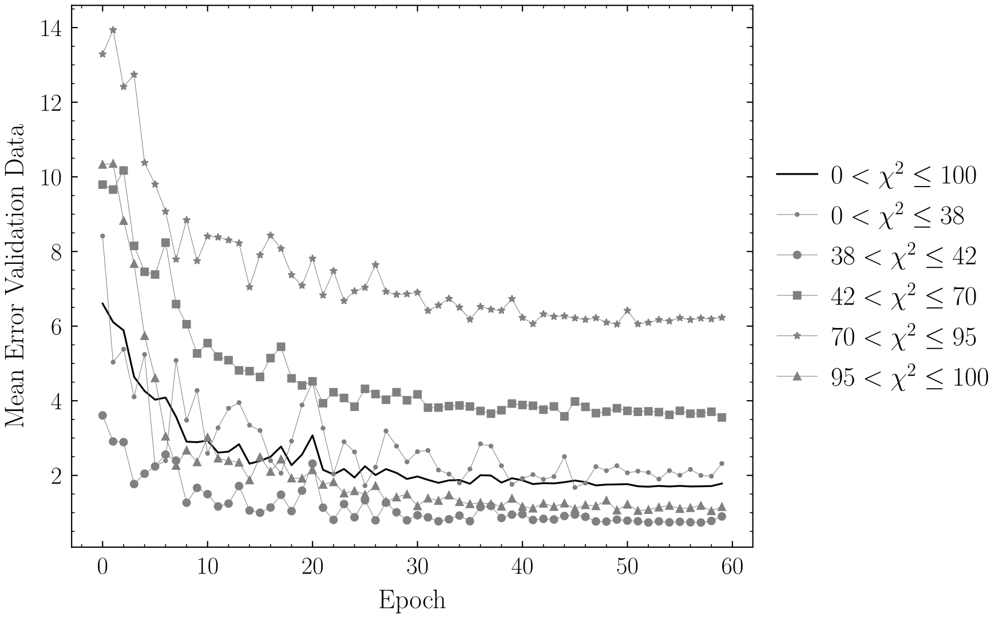

# SCYNet

## Overview
This repository contains the neural network for testing supersymmetric models against measurements from the Large Hadron Collider (LHC). The networks take as input the 11 parameters of the phenomenological Minimal Supersymmetric Standard Model (pMSSM-11) and predict a single output value: a χ² statistic. Lower χ² values indicate better agreement between a given pMSSM-11 parameter point measurements from the LHC. Here we describe the model corresponding to the direct approach described in the SCYNet paper [1]. Additional details on the methodology, network architecture, and training procedure can be found in Ref. [1] and in my Master's thesis [2].



In the following figure, we show a histogram of all χ² values in the full dataset used to train and validate the model. Because of the way the data was generated in the 11-dimensional parameter space, there are two clear peaks around 40 and 100. In other words, there are many more data points with target values around these two regions than with target values in between the peaks. 

<p align="center">
  <br>
  <em>Histogram of the target χ² distribution</em>
</p>

In the following figure, we show the mean error on the validation set after each epoch. The solid black line shows the overall mean error, while the other lines show the mean error in different target ranges. The target ranges shown here are marked by vertical dashed lines in the histogram above.
We observe that the mean error is generally smaller in the target ranges that contain more data points. We call this the **rare target learning problem (RTLP)**. It is a general feature that we have observed: the network learns targets better when they appear more frequently in the dataset.
We have tried to mitigate this behavior in several ways (more details below). While we were able to improve the performance, we were not able to reduce the error in the rare target ranges to the same level as in the other ranges.


<p align="center">
  <br>
  <em>Mean error with respect to the training epoch</em>
</p>


The error in the target ranges where we have less training targets is significatly larger than the error in the ranges where more training data is available. The ranges that are shown in the above figure are marked by vertical dashed lines in the data histogram. We call this the rare target learning problem (RTLP).


Unpack data in training_code/data before running anything.

Details:

We have done an extensive hyperparameter scan. The results presented above represent the results with the best hyperparameter set. We used a test set in order not to overfit hyperparameters.

With Tensorfolw

We trained two neural networks. One network comparaes pMSSM-11 parameter points with LHC measurements at 8 TeV and the other one with measurements at a higher energy 13 TeV.


The neural network was optimized through extensive hyperparameter scans to achieve the best possible performance. The codebase is written primarily in Python 3 and uses TensorFlow for training and inference.

Variables to change in the code if people want to play around
- network architecture number of hidden layers
- Number of neuros per hidden layers

- Train existing network that has been trained before
- Train existing network only with χ² in a specific range to make rare target learning problem better.
- Sequence learning to make rare target learning problem better.

Extend data artificially  in χ² ranges with low data coverage.

- Chose different cost functions
- 


Two networks. One for comparison with 8TeV meansurements and one for comparison with 13 TeV measurements.


## Repository Structure

```text
SCYNet/
├── README.md
├── training_code/
│   ├── train_LHC_chi2_neural_net.py
│   ├── network_architecture.png
│   └── MORE.py
├── trained_networks/
    ├── cpp
│   └── python
        ├── get_chi2_13TeV_from_best_net.py
        ├── net_13TeV.ckpt
        └── transformations.py
└── docs/
    └── thesis.pdf
```


## training_code

The training code is not ready to use on any computer yet. I still need to upload the data that is necessary to train the network


## trained_networks (python)

This folder contains the trained networks that are ready to use. This i for a 13 TeV network, i.e. the network compares the pMSSM-11 model to measurements at the LHC with 13 TeV center of mass energy

Example call: python3 get_chi2_13TeV_from_best_net.py M1  M2  M3  msq12 msq3 msl12 msl3 M_A A_0 mu tan(beta)

where (M1  M2  M3  msq12 msq3 msl12 msl3 M_A A_0 mu tan(beta)) are the 11 parameters of the supersymmetric model. More details in [1,2]


## trained_networks (cpp)

We also provide a framework that allows the network to be embedded in C++ code and called directly from the C++ implementation. This can be useful in applications where speed is important. For example, in global fits, where one aims to identify the best-fit parameters of the pMSSM-11, one typically needs to scan over a large parameter space.

```text
make
make run
./run
```


[1] https://arxiv.org/abs/1703.01309

[2] See docs folder
